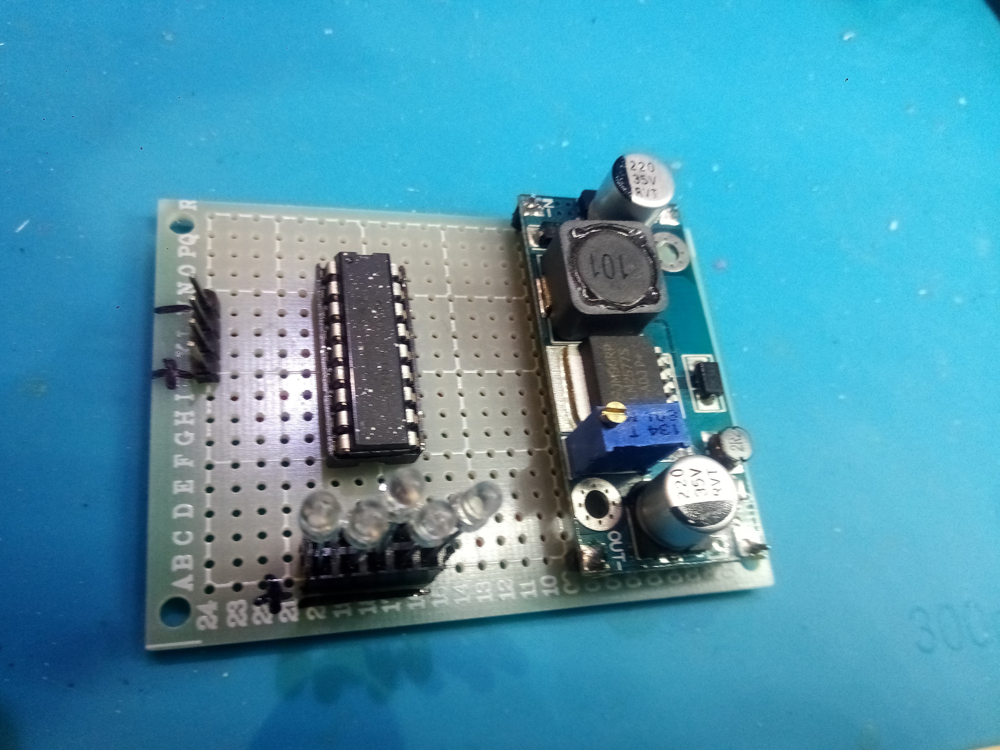

# Lipo_2S_charge_indicator

Bargraph displaying charge status of a 2S lipo battery

Voltage levels inspired by https://blog.ampow.com/lipo-voltage-chart/

Voltage level are conservative so that battery life is preserved

First led is always on even is battery is weak, 4 other leds will indicate charge status.

Voltage levels are: 7.4V   7.6V  7.9V  8.2V

If voltage is < 7.4V  (Only first led ON) -> must stop operation otherwise battery life will be shortened

If voltage is > 8.2V (All leds ON) -> full: no need to recharge more

The LM3916 needs +12V to operate, therefore a step-up converter had to be added to the design

